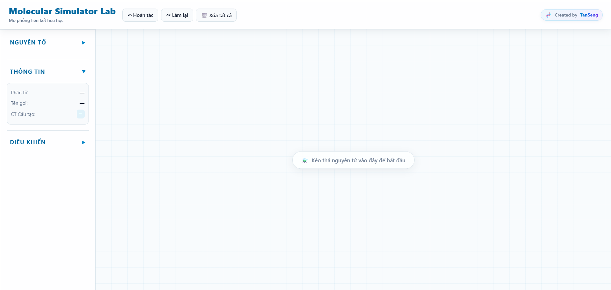
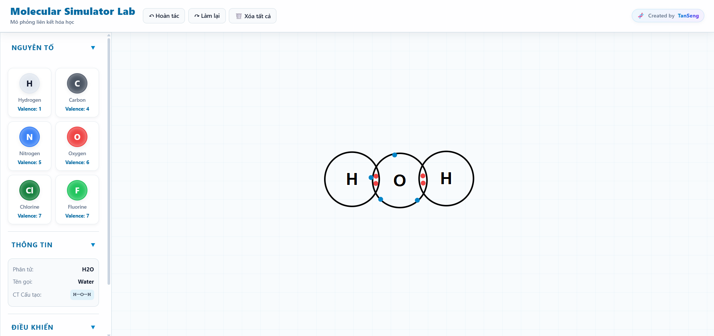

<div align="center">

# 🧬 Molecular Simulator Lab

### Mô phỏng liên kết hóa học ngay trên trình duyệt

Kéo thả nguyên tử, ghép chúng lại và xem các electron dùng chung hình thành liên kết cộng hóa trị theo thời gian thực.


</div>

---

## 📖 Giới thiệu

**Molecular Simulator Lab** là ứng dụng web mô phỏng liên kết hóa học, giúp người học *nhìn thấy* cách các nguyên tử liên kết với nhau thay vì chỉ học thuộc công thức. Người dùng chọn nguyên tố, kéo thả vào không gian làm việc, đưa các nguyên tử lại gần nhau và quan sát các cặp electron dùng chung được tạo thành. Khi ghép ra một phân tử hợp lệ, ứng dụng hiển thị **công thức phân tử, tên gọi và công thức cấu tạo** của chất đó.

### ✨ Tính năng chính

- **Bảng nguyên tố** dạng thu gọn/mở rộng, chọn nguyên tố rồi kéo thả vào không gian làm việc.
- **Tạo liên kết cộng hóa trị** bằng cách kéo các nguyên tử lại gần nhau, mô phỏng bằng SVG.
- **Hoạt ảnh electron** dùng chung, có thể bật/tắt và chỉnh tốc độ (0–200).
- **Bảng thông tin** hiển thị phân tử, tên gọi và công thức cấu tạo của chất vừa ghép.
- **Hoàn tác / Làm lại** và **Xóa tất cả** có hộp thoại xác nhận.
- **Phóng to / thu nhỏ / đặt lại** khung nhìn.
- **Hướng dẫn nhanh** dạng cửa sổ chào mừng cho người dùng mới, kèm thông báo (toast) và hiệu ứng chúc mừng.
- **Cơ sở dữ liệu hợp chất** khoảng 250 chất (vô cơ và hữu cơ), mỗi chất có công thức, tên, số liên kết, bậc liên kết và danh sách nguyên tử/liên kết cụ thể.

### 🛠️ Vì sao chọn công nghệ này?

| Công nghệ | Lý do |
|---|---|
| **HTML/CSS/JavaScript thuần** | Không cần build, không cần cài đặt, mở file là chạy được, phù hợp để dạy và học. |
| **SVG** | Vẽ nguyên tử, liên kết và electron sắc nét ở mọi mức zoom, dễ gắn sự kiện kéo thả và hoạt ảnh. |
| **Dữ liệu JSON tách riêng** | Thêm hoặc sửa hợp chất mà không cần đụng vào logic mô phỏng. |
| **Mã nguồn chia module** | Mỗi file phụ trách một phần (electron, nguyên tử, phân tử, mô phỏng, giao diện) nên dễ đọc và mở rộng. |

### 🚧 Thử thách và hướng phát triển

- Xác định khi nào một nhóm nguyên tử tạo thành phân tử hợp lệ, kể cả liên kết đôi, liên kết ba và mạch vòng.
- Hiển thị công thức cấu tạo đúng cho các chất phức tạp (vòng benzen, đường, amino axit...).
- Dự kiến: mô phỏng liên kết ion, hiển thị hình dạng phân tử 3D (VSEPR), xuất ảnh phân tử, chế độ tối, chế độ thử thách (đề bài: ghép phân tử X).

---

## 📑 Mục lục

- [Giới thiệu](#-giới-thiệu)
- [Cài đặt và chạy dự án](#-cài-đặt-và-chạy-dự-án)
- [Cách sử dụng](#-cách-sử-dụng)
- [Cấu trúc thư mục](#-cấu-trúc-thư-mục)
- [Cấu trúc dữ liệu hợp chất](#-cấu-trúc-dữ-liệu-hợp-chất)
- [Đóng góp cho dự án](#-đóng-góp-cho-dự-án)
- [Kiểm thử](#-kiểm-thử)
- [Tác giả và ghi nhận](#-tác-giả-và-ghi-nhận)
- [Giấy phép](#-giấy-phép)

---

## 🚀 Cài đặt và chạy dự án

Dự án là một trang web tĩnh, **không cần cài thêm thư viện nào**.

### Yêu cầu

- Trình duyệt hiện đại (Chrome, Edge, Firefox, Safari bản mới).
- *(Khuyến nghị)* Một web server cục bộ, vì trình duyệt thường chặn đọc file JSON khi mở trực tiếp bằng `file://`.

### Các bước

**1. Tải mã nguồn**

```bash
git clone https://github.com/TanSeng2027/MoPhongLienKetHoaHoc.git
cd MoPhongLienKetHoaHoc
```

**2. Chạy bằng web server cục bộ** (chọn một cách)
```bash
# Các bạn download extentions là Live Server
Open with Live Server 
```

### Triển khai lên GitHub Pages

1. Vào **Settings → Pages** của repository.
2. Ở mục *Build and deployment*, chọn **Deploy from a branch**, nhánh `main`, thư mục `/ (root)`.
3. Sau ít phút, trang chạy tại `https://tanseng2027.github.io/MoPhongLienKetHoaHoc/`.

---

## 🎮 Cách sử dụng

1. **Chọn nguyên tố:** mở bảng **Nguyên tố** ở thanh bên trái và chọn nguyên tố cần dùng.
2. **Kéo thả nguyên tử** vào không gian làm việc ở giữa màn hình.
3. **Tạo liên kết:** kéo các nguyên tử lại gần nhau để chúng liên kết cộng hóa trị.
4. **Quan sát electron dùng chung** được hình thành giữa các nguyên tử.
5. **Xem thông tin:** bảng **Thông tin** hiện phân tử, tên gọi và công thức cấu tạo của chất vừa ghép.
6. **Khám phá thêm** nhiều phân tử khác nhau.

### Điều khiển

| Thao tác | Cách làm |
|---|---|
| Hoàn tác | Nút **↶ Hoàn tác** hoặc `Ctrl + Z` |
| Làm lại | Nút **↷ Làm lại** hoặc `Ctrl + Y` |
| Xóa tất cả | Nút **🗑️ Xóa tất cả** (có bước xác nhận) |
| Bật/tắt hoạt ảnh electron | Ô **Electron Animation** trong mục *Điều khiển* |
| Chỉnh tốc độ hoạt ảnh | Thanh trượt **Tốc độ** (0 – 200) |
| Phóng to / thu nhỏ | Nút **+** / **-**; nút **Reset Zoom** để về mặc định |

### Ví dụ nên thử

| Phân tử | Nguyên tử cần | Liên kết |
|---|---|---|
| Nước (H₂O) | 2 H + 1 O | 2 liên kết đơn O–H |
| Cacbon đioxit (CO₂) | 1 C + 2 O | 2 liên kết đôi C=O |
| Nitơ (N₂) | 2 N | 1 liên kết ba N≡N |
| Amoniac (NH₃) | 1 N + 3 H | 3 liên kết đơn N–H |
| Metan (CH₄) | 1 C + 4 H | 4 liên kết đơn C–H |
| Axit xyanhiđric (HCN) | 1 H + 1 C + 1 N | H–C (đơn), C≡N (ba) |

> 📸 **Ảnh minh họa:** thêm ảnh chụp màn hình vào thư mục `docs/` (hoặc `screenshots/`) rồi chèn vào đây:
>
> ```markdown
> 
> 
> ```

---

## 🗂️ Cấu trúc thư mục

```text
MoPhongLienKetHoaHoc/
├── index.html          # Trang chính: giao diện, bảng nguyên tố, cửa sổ hướng dẫn
├── css/
│   └── style.css       # Giao diện của ứng dụng
├── data/  
|   └── molecule.json   # Dữ liệu hợp chất (JSON)
└── js/
    ├── electron.js     # Lớp/logic electron và hoạt ảnh electron
    ├── atom.js         # Lớp nguyên tử
    ├── molecule.js     # Lớp phân tử, nhận diện chất
    ├── simulation.js   # Vòng lặp mô phỏng, kéo thả, tạo liên kết
    ├── ui.js           # Xử lý giao diện: bảng, nút, modal, toast
    └── app.js          # Điểm khởi chạy, nối các module lại với nhau
```

---

## 🧪 Cấu trúc dữ liệu hợp chất

Mỗi hợp chất trong `data/` là một đối tượng JSON:

```json
{
  "formula": "HCN",
  "name": "Hydrogen cyanide",
  "atoms": { "H": 1, "C": 1, "N": 1 },
  "bonds": 2,
  "bondOrders": [1, 3],
  "structural": "H—C≡N",
  "atomList": ["C", "N", "H"],
  "bondList": [[0, 1, 3], [0, 2, 1]]
}
```

| Trường | Ý nghĩa |
|---|---|
| `formula` | Công thức phân tử |
| `name` | Tên gọi (danh pháp quốc tế) |
| `atoms` | Số nguyên tử của từng nguyên tố |
| `bonds` | Tổng số liên kết |
| `bondOrders` | Bậc của từng liên kết (1 = đơn, 2 = đôi, 3 = ba) |
| `structural` | Công thức cấu tạo dạng chữ (để hiển thị nhanh) |
| `atomList` | Danh sách nguyên tử theo chỉ số (gồm cả H) |
| `bondList` | Danh sách liên kết `[chỉ số A, chỉ số B, bậc liên kết]`, dùng để vẽ đúng cấu trúc |

---

## ✅ Kiểm thử

Hiện dự án **chưa có bộ test tự động**. Bạn có thể kiểm tra theo hai cách dưới đây.

### 1. Kiểm tra dữ liệu bằng script

Lưu đoạn sau thành `validate-data.js` (sửa đường dẫn file JSON cho đúng với thư mục `data/` của bạn) rồi chạy `node validate-data.js`:

```js
const fs = require("fs");
const compounds = JSON.parse(fs.readFileSync("data/compounds.json", "utf8"));

let errors = 0;
for (const c of compounds) {
  const counts = {};
  (c.atomList || []).forEach(a => (counts[a] = (counts[a] || 0) + 1));

  const sameAtoms = JSON.stringify(Object.entries(counts).sort()) ===
                    JSON.stringify(Object.entries(c.atoms).sort());
  const sameBonds = (c.bondList || []).length === c.bonds &&
                    c.bondOrders.length === c.bonds;

  if (!sameAtoms || !sameBonds) {
    console.error(`❌ ${c.formula} (${c.name}) không khớp dữ liệu`);
    errors++;
  }
}
console.log(errors ? `Có ${errors} lỗi` : `✅ ${compounds.length} hợp chất hợp lệ`);
process.exit(errors ? 1 : 0);
```

### 2. Kiểm tra thủ công

- [ ] Mở trang, cửa sổ hướng dẫn hiện ra và nút **Bắt đầu** hoạt động.
- [ ] Kéo thả nguyên tử vào không gian làm việc thành công.
- [ ] Ghép 2 H + 1 O tạo ra nước, bảng **Thông tin** hiện `H₂O`.
- [ ] Ghép 2 O tạo liên kết đôi, 2 N tạo liên kết ba.
- [ ] `Ctrl+Z` và `Ctrl+Y` hoàn tác/làm lại đúng.
- [ ] **Xóa tất cả** hiện hộp thoại xác nhận, bấm **Hủy** thì không xóa.
- [ ] Bật/tắt **Electron Animation** và kéo thanh **Tốc độ** có tác dụng.
- [ ] Zoom `+`, `-`, **Reset Zoom** hoạt động.
- [ ] Giao diện dùng được trên màn hình điện thoại.

---

## 👤 Tác giả và ghi nhận

**Lữ Chiến Tấn Sang** (GitHub: [@TanSeng2027](https://github.com/TanSeng2027)), tác giả và người phát triển chính.

- Kiến thức về liên kết hóa học: sách giáo khoa Hóa học phổ thông

Cảm ơn bạn đã ghé thăm dự án. Nếu thấy hữu ích, đừng quên tặng một ⭐ nhé!

---


<div align="center">

**Made with 🧬 by TanSeng**

</div>
